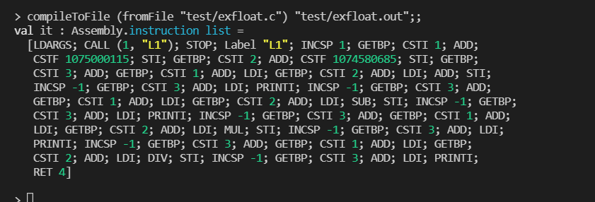
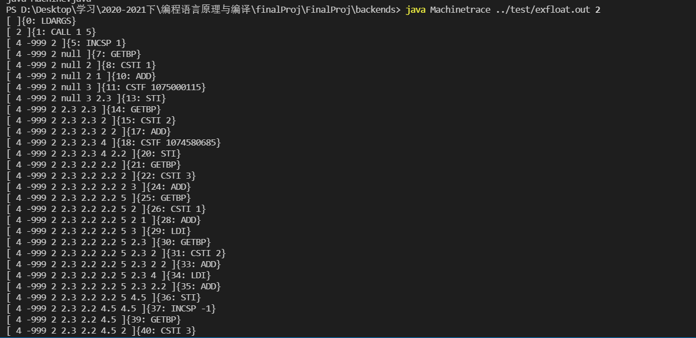
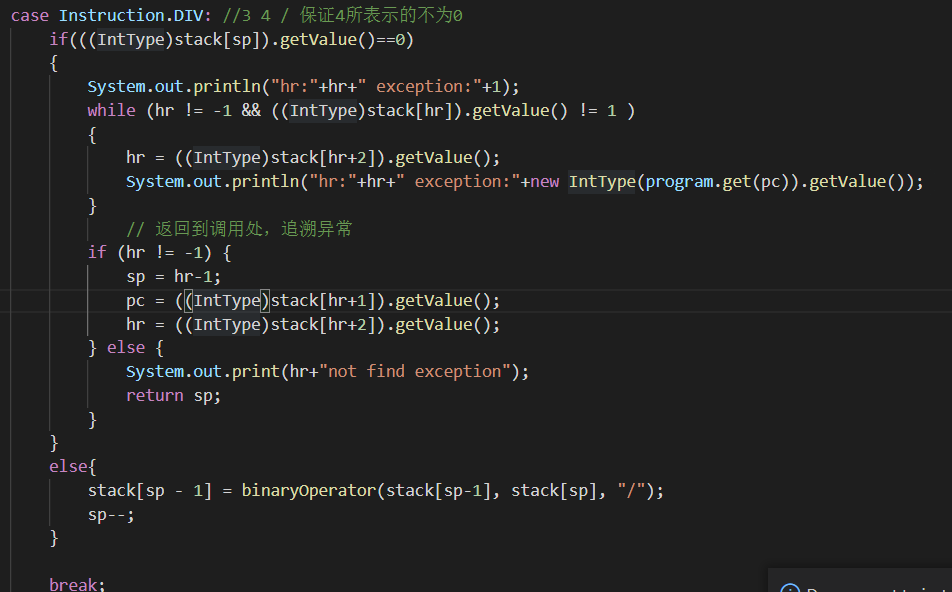
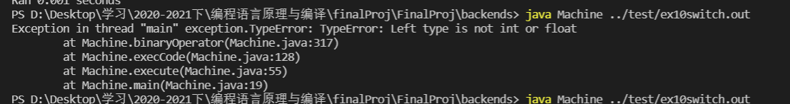

# **2020-21学年第2学期**

## **实 验 报 告**


-   课程名称: <u>编程语言原理与编译</u>
-   实验项目: <u>期末大作业</u>
-   专业班级: <u>计算1802</u>
-   学生学号: <u>30801091</u>
-   学生姓名: <u>朱宇欢</u>
-   实验指导教师: <u>郭鸣</u>

---

## 1. 简介

---

编译原理大作业，基于microc和参考资料Cuby完成，取名为FinalProj，即期末大作业，在努力理解了如何实现一个编译器的各个文件后，模仿microc完成了当前项目，并进行了一定的的完善，但还有很多的不足，还需要更多地学习

---

## 2. 项目自评等级

---

|                                     |       |                                  |
| ----------------------------------- | ----- | -------------------------------- |
| 功能                                | 评分  | 备注                             |
| 注释 // /**/                        | ⭐⭐⭐⭐⭐ |                                  |
| 恒定常数单引号''双引号''三引号''    | ⭐     |                                  |
| 数值常数0b0101，八位0o777十六0xFFDA |       |                                  |
| 语法                                | ⭐     |                                  |
| float                               | ⭐⭐⭐   | 参考Cuby，改正其无法做除法的问题 |
| 循环 for / while / do while / until | ⭐⭐⭐   |                                  |
| for in 表达式                       | ⭐⭐⭐   |                                  |
| 自增自减                            | ⭐⭐⭐   |                                  |
| 加减乘除的+=方式                    | ⭐⭐⭐   |                                  |
| 增加sleep                           | ⭐⭐⭐⭐⭐ |                                  |
| 增加String                          | ⭐⭐⭐   | 只在后端添加                     |
| 字符串加法，组合输出                | ⭐⭐⭐⭐⭐ |                                  |

---

## 3. 结构

---

### 3.1 前端(F#)

#### 3.1.1 编译器

* AbstractSyntax.fs 定义抽象语法
  * 定义了基础类型：TypeInt，TypeChar，TypeFloat，TypeVoid，TypeStruct，TypeArray等
  * 定义了基础表达式：访问，赋值，取值的地址，**访问并赋值**，常数int值，常数String值，常数Float值，空值，以及一元，二元，三元的表达式，And，Or的判断表达式，跳转
  * if，while，do-while，Expression，return，block，for，throw，switch-case，try-catch，continue，break，**sleep**等声明的定义
  * 异常，函数，变量，语句块等的定义
* 由MyLex.fsl生成的MyLex词法生成器
  * 将程序中代码，一般为小写的关键字翻译为大写，“char”-> "CHAR"
  * 将程序中操作符翻译，例：“%=”-> "MODEQ"
* 由MyPar.fsy生成的MyPar语法生成器
  * 定义token：1.定义CSTINT，CSTCHAR，CHAR，WHILE等token，token就是把程序(.c)用token翻译
  * 声明，例如将声明ExprNotAccess，并模式匹配到“Access PLUSEQ Expr          { AssignThird("+=",$1,$3)}”，在AbstractSyntax已经定义了AssignThird，第一个参数为String，第二个为Access，为可访问的值，第三个为Expr，为表达式
  * 将程序经过MyLex词法分析翻译后，通过MyPar进行语法分析
* Assembly.fs 定义了中间表示的生成指令
* Combile.fs 将程序的抽象语法树转化为中间表示

#### 3.1.2 解释器

* Interp.fs
* interpc.fs

### 3.2 后端(Java)

* package exception定义了异常，分别为操作符错误(OperatorError.java)和类型错误(TypeError.java)
* package mytype 定义类型，有基础类型(basic)，Array，Char，Float，Int
* Instruction.java 定义指令
* Machine.java生成Machine.class虚拟机和Machinetrace.class堆栈追踪

### 3.3 测试集

* 测试集位于test文件夹中

### 3.4 库

* FsLexYacc.Runtime.dll

---

## 4. 用法

---

### 4.1 前端

#### 4.1.1 编译器

* 写完AbstractSyntax.fs

* MyPar.fsy引入AbstractSyntax，通过MyPar.fsy生成MyPar.fs语法分析器

  ```sh
  dotnet "C:\Users\飞天小女警\.nuget\packages\fslexyacc\10.2.0\build\/fsyacc/netcoreapp3.1\fsyacc.dll"  -o "MyPar.fs" --module MyPar MyPar.fsy
  ```

* MyLex.fsl 代码中打开 MyPar，通过MyLex.fsl生成MyLex.fs词法分析器

  ```sh
  dotnet "C:\Users\飞天小女警\.nuget\packages\fslexyacc\10.2.0\build\/fslex/netcoreapp3.1\fslex.dll"  -o "MyLex.fs" --module MyLex --unicode MyLex.fsl
  ```

* 命令行运行程序，引入引用包

  ```sh
  dotnet fsi
  #r "nuget: FsLexYacc";;  //添加包引用
  ```

* 加载运行该编译器

  ```sh
  #load "AbstractSyntax.fs" "MyPar.fs" "MyLex.fs" "Debug.fs" "Parse.fs" "Assembly.fs" "Combile.fs" "ParseAndComp.fs" ;;
  ```

* open parseAndComp，之后可在fsi中进行编译 *.c文件,生成中间表示 *.out

  ```sh
  open ParseAndComp;;
  compileToFile (fromFile "test/exfloat.c") "test/exfloat.out";;  
  ```

* 中间表示(指令集)

  ```sh
  24 19 1 5 25 15 1 13 0 1 1 0 0 12 15 -1 16 41 13 0 1 1 11 22 15 -1 13 0 1 1 13 0 1 1 11 0 1 1 12 15 -1 13 0 1 1 11 13 11 7 18 18 21 1
  ```

#### 4.1.2 解释器

* 命令行运行程序，引入引用包

```sh
# 命令行运行程序
dotnet fsi 
#r "nuget: FsLexYacc";;  //添加包引用
```

* 载入程序

```sh
#load "AbstractSyntax.fs" "Debug.fs" "MyPar.fs" "MyLex.fs" "Parse.fs" "interp.fs" "ParseAndRun.fs" ;; 
```

* 导入模块并运行

```sh
open ParseAndRun;;    //导入模块 ParseAndRun
fromFile "test\ex1.c";;    //显示 ex1.c的语法树
run (fromFile "test\ex1.c") [17];; //解释执行 ex1.c
```

### 4.2 后端

* javac编译后端虚拟机 *.java 文件

  ```sh
  javac -encoding UTF-8 Instruction.java mytype/*.java exception/*.java Machine.java 
  ```

* java Machine 运行在前端已经产生的中间表示 *.out

* java Machinetrace 追踪堆栈变化

  ```
  java Machine ex2.out 8
  java Machinetrace ex2.out 8
  ```

---

## 5. 项目说明

---

项目是基于已有的microc代码，参考Cuby代码

* 在microc的基础上参考Cuby添加：
  * 变量Float，char，struct，改了float和char一些存在的问题
  * 自增自减
  * do-while循环
  * for循环
  * switch-case方法
  * break,continue
* 在microc的基础上独立添加：
  * String变量，字符串输出
  * 加减乘除余的简易方法(+=,-=,*=,/=,%=)
  * Slepp方法，暂停进程一段时间
  * 注释的多样化

---

## 解决技术要点说明

---

### 前端部分+后端部分

##### 1. 变量部分，添加String，实现字符的+，组合

```c
int main(){

    char a = 'h';
    char c = 'e';
    char d = 'l';
    char b[10];

    // for(i = 0; i < 10; ++i){
    //     b[i] = i;
    // }

    // for(i = 0; i < 10; ++i){
    //     print b[i];
    // }
    b[0] = a;
    b[1] = c;
    b[2] = d;
    print b[1]+b[2];

} 
```

前端编译为指令集：

.png)

后端运行结果：运行与运行栈追踪:

运行.png)

##### 2. 添加float，单精度浮点类型，并改进

* AbstractSyntax.fs —— 抽象语法树文件（模仿int）
  * 基础类型：TypeFloat
* MyLex.fs —— 词法分析器（模仿int）
  * 关键词：float --> FLOAT
  * 语法token：形如 ['0'-'9']+'.'['0'-'9']+ ，即字符串类型的例如：3.12 ，由字符串转化为CSTFLOAT类型，{CSTFLOAT (System.Single.Parse (lexemeAsString lexbuf))}，其中System.Single.Parse将字符串lexbuf转化为单精度浮点数
* MyPar.fs —— 语法分析器（模仿int）
  * token：float32类型的CSTFLOAT，token，FLOAT
  * 类型：定义FLOAT的类型为TypeFloat
  * 声明：声明与float有关的变量描述，定义
* Assembly.fs —— 汇编编译指令集（模仿int）
  * 定义指令CSTF
  * 定义CODECSTF为数字指令26，
  * makelabenv，获得abel在机器码中的地址，记录当前的（label，addr）到labenv中。
* Combile.fs —— 将程序的抽象语法树转化为中间表示
  * addCSTF , float进入到指令集，及其字节值

* 后端将指令中的int字节转换为FloatType，并入栈

代码：

```c
void main(int n){
    float x;
    x = 2.3;
    float y;
    y = 2.2;
    float z;
    z = x+y;
    print z;
    z = x-y;
    print z;
    z = x*y;
    print z;
    z = x/y;
    print z;
}
```

前端编译为指令集：



后端运行指令集：栈追踪



##### 3. 修改注释的表示方式，添加(* *),在MyLex.fsl中添加

```F#
rule Token = parse
  | "//"            { EndLineComment lexbuf; Token lexbuf }
  | "/*"            { Comment lexbuf; Token lexbuf }
  | "(*"            { Comment lexbuf; Token lexbuf }
```

##### 4. **sleep功能**

1. AbstractSyntax.fs

   添加 Sleep of IExpression

2. MyPar.fs MyLex.fs

   添加关键词sleep，用于解析代码中的sleep为SLEEP，理解print的语法分析写sleep的语法分析

3. Assembly.fs

   添加SLEEP指令

4. Combile.fs

   在UnaryPrimitiveOperator，一元操作中添加sleep功能。

5. 后端添加SLEEP的指令并处理，达到使进程暂停的目的。

简介：加入C语言sleep(),让进程暂停一段时间

```c
void main() { 
    sleep(3000);
}
```

前端编译为指令集：

.png)

后端运行结果：运行与运行栈追踪

运行.png)

##### 5. 添加+=，-=，*=，/=,%=操作

​	由于这个运算方式 x+=1，对于x需要取值访问，还要对其赋值，需要添加这种访问方式，模仿UnaryPrimitiveOperator，BinaryPrimitiveOperate，添加AssignThird

1. AbstractSyntax.fs添加AssignThird

   ```F#
   AssignThird of string * IAccess * IExpression
   ```

2. MyPar.fs

   ```F#
   ExprNotAccess:
       AtExprNotAccess                     { $1                  }
    | Access PLUSEQ Expr                    {  AssignThird("+=",$1,$3)}
     | Access MINUSEQ Expr                   {  AssignThird("-=",$1,$3)}
     | Access TIMESEQ Expr                   {  AssignThird("*=",$1,$3)}
     | Access DIVEQ Expr                     {  AssignThird("/=",$1,$3)}
     | Access MODEQ Expr                     {  AssignThird("%=",$1,$3)}
   ```

3. MyLex.fsl

   添加token，

   ```F#
   rule Token = parse
     | "+="            { PLUSEQ }
     | "-="            { MINUSEQ }
     | "*="            { TIMESEQ }
     | "/="            { DIVEQ }
     | "%="            { MODEQ}
   ```

4. Combile.fs

   在表达式处添加在AbstractSyntax添加的内容

   ```F#
   | AssignThird(ope,acc,e) ->
           let rec tmp stat = 
                       match stat with
                       |Access(c) -> c  
           cAccess acc varEnv funEnv lablist structEnv
           ( cExpr e varEnv funEnv lablist structEnv
               (match ope with
               | "+=" ->
                   let ass = Assign (acc,BinaryPrimitiveOperator("+",Access(acc),e))
                   cExpr ass varEnv funEnv lablist structEnv (addINCSP -1 C)
               | "-=" ->
                   let ass = Assign (acc,BinaryPrimitiveOperator("-",Access(acc),e))
                   cExpr ass varEnv funEnv lablist structEnv (addINCSP -1 C)
               | "*=" ->
                   let ass = Assign (acc,BinaryPrimitiveOperator("*",Access(acc),e))
                   cExpr ass varEnv funEnv lablist structEnv (addINCSP -1 C)
               | "/=" ->
                   let ass = Assign (acc,BinaryPrimitiveOperator("/",Access(acc),e))
                   cExpr ass varEnv funEnv lablist structEnv (addINCSP -1 C)
               | "%=" ->
                   let ass = Assign (acc,BinaryPrimitiveOperator("%",Access(acc),e))
                   cExpr ass varEnv funEnv lablist structEnv (addINCSP -1 C)
               | _     -> failwith "Error2: unknown operator"
               )
           )
   ```

简介：包含+=，-=等操作

```c
void main(int n) { 
    n+=3;
    print n;
}
```

前端编译为指令集：

.png)

后端运行结果：运行与运行栈追踪

运行.png)

1. 循环的多种实现：do-while

   简介：先判断，再进行运行

   前端编译为指令集:

   .png)

   后端运行结果：运行与运行栈追踪

   运行.png)

2. for 循环

   简介：for循环

   前端编译为指令集：

   .png)

   后端运行，运行与运行栈追踪：

   运行.png)

3. 自增操作

   简介：实现i++，i--的操作

   ```c
   int main(){
       int i = 8;
       i++;
       print i;
       i++;
       print i;
       i--;
       print i;
   }
   ```

   前端编译为指令集：

   .png)

   后端运行，运行与运行栈追踪：

   运行.png)

4. switch-case

   简介：类似于C语言的switch-case，当没有break时候，匹配到一个case后，执行该case的body，并且会往下执行所有case的body。没有匹配到case时，不会执行body，且向下寻找匹配的case

   前端编译为指令集：

   .png)

   后端运行，运行与运行栈追踪：

   运行.png)

### 后端部分

1. 类型

   * basic父类

   * Int继承basic类
   * Char继承basic类
   * **String**继承basic类
   * Array继承basic类
   * Float继承basic类

   ```java
   package mytype;
   
   public class StringType extends basicType {
       private String value;
   
       StringType(){
           value = new String("zzzzz");
       }
   
       public StringType(char c){
           value = String.valueOf(c);
       }
       public StringType(String c){
           value = c;
       }
       public String getValue() {
           return value;
       }
   
       public void setValue(char value) {
           this.value = String.valueOf(value);
       }
   
       public String addChar(String value){
           return this.value + value;
       }
   
       public String toString(){
           return value;
       }
   }
   
   ```

2. 异常
   * 类型错误：TypeError
   * 操作符错误： OperatorError

   ```java
   package exception;
   
   public class OperatorError extends Exception {
       public OperatorError(String msg){
           super(msg);
       }
   }
   ```

3. Instruction

   * 增加指令SLEEP

     ```java
     public class Instruction {
         public final static int CSTI = 0;
         public final static int ADD = 1;
         public final static int SUB = 2;
         public final static int MUL = 3;
         public final static int DIV = 4;
         public final static int MOD = 5;
         public final static int EQ = 6;
         public final static int LT = 7;
         public final static int NOT = 8;
         public final static int DUP = 9;
         public final static int SWAP = 10;
         public final static int LDI = 11;
         public final static int STI = 12;
         public final static int GETBP = 13;
         public final static int GETSP = 14;
         public final static int INCSP = 15;
         public final static int GOTO = 16;
         public final static int IFZERO = 17;
         public final static int IFNZRO = 18;
         public final static int CALL = 19;
         public final static int TCALL = 20;
         public final static int RET = 21;
         public final static int PRINTI = 22;
         public final static int PRINTC = 23;
         public final static int LDARGS = 24;
         public final static int STOP = 25;
         public final static int CSTF = 26;
         public final static int CSTC = 27;
         public final static int THROW = 28;
         public final static int PUSHHR = 29;
         public final static int POPHR = 30;
         public final static int SLEEP = 31;
     }
     ```

4. 捕捉异常——实现异常追溯

   

   

---

## 6. 心得体会

---

​	编译原理，从一开始就觉得难，期待着到后面会好起来，但是直到大作业前都没有一个系统的了解，学了后面忘记前面，麻木地坐着作业，迷迷糊糊，一直很迷茫，直到大作业的到来，像是赶鸭子上架一般，就容不得再这样麻木下去，于是打开microc，和之前同学做的Cuby，开始仔细看一个编译器结构的组成和一个功能实现的步骤，收获颇多，但在理解代码的过程中依然很难，尤其是编译的compile.fs文件，看下去没几个函数能够理解，很痛苦，然后尝试模仿Cuby实现一个功能的过程来实现一个他们已经有的功能，然后再根据已经有的功能来实现一个新的功能，几回下来有了一个模糊的意识，增加一个功能的步骤是这样的。一个程序代码进入前端的编译器，首先是通过MyLex进行翻译，然后再到MyPar进行进一步的分析，最后到compile.fs进行编译，MyLex与MyPar利用AbstractSyntax对抽象语法树的定义生成抽象语法树，compile利用Assembly中定义的生成中间代码的指令进行编译，感觉是这么的一个过程。而后端实际上就是根据这些指令来运行代码。理解这个的过程，跑起来代码后，改错，对已经成型的compile.fs的稍加改动都会有很多的报错，然后发现自己好像还是没懂，再改再看。遗憾的是因为自己能力的问题，没有独立添加一些功能，我觉得这个问题要追溯到之前对语言的掌握不够巩固，因为在想增加功能的时候，我发现我对很多概念都已模糊。计算机学科的学习，我确实还有很长的路要走。